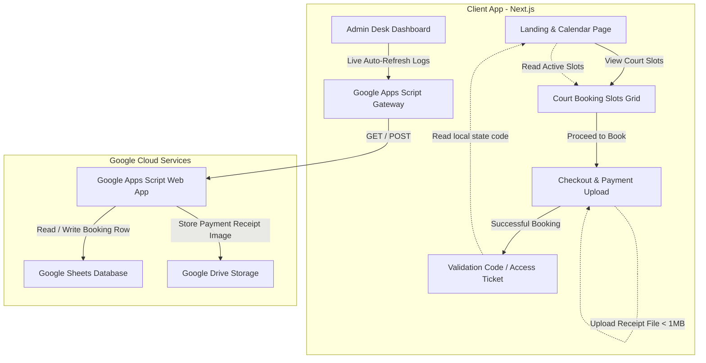
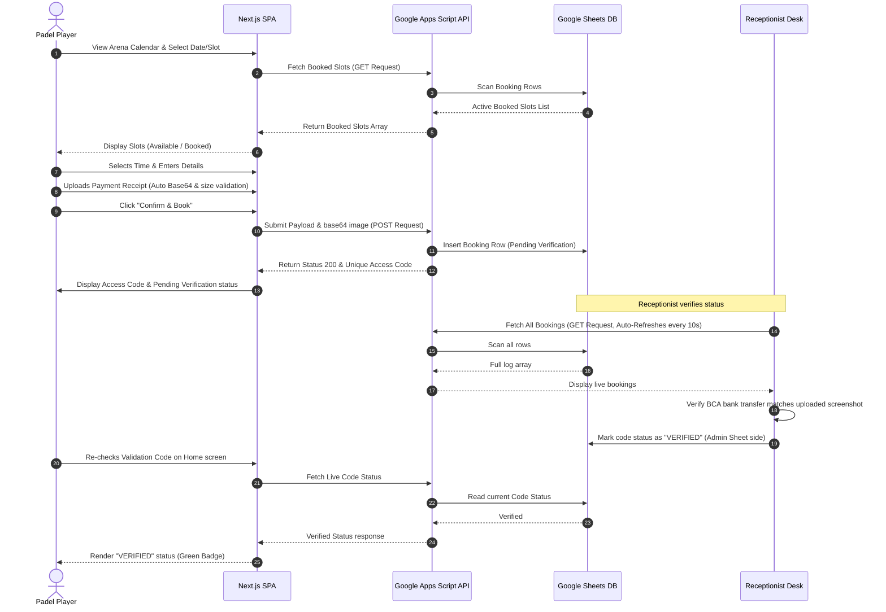
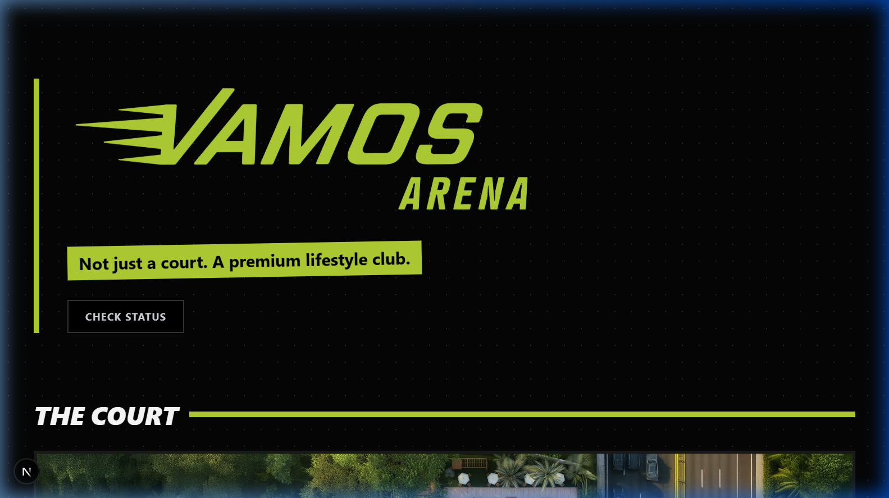
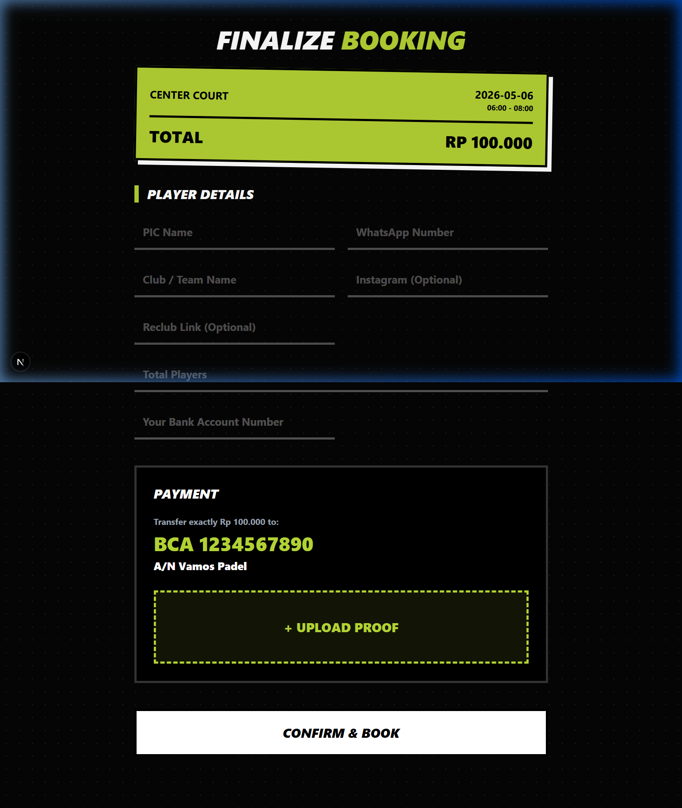
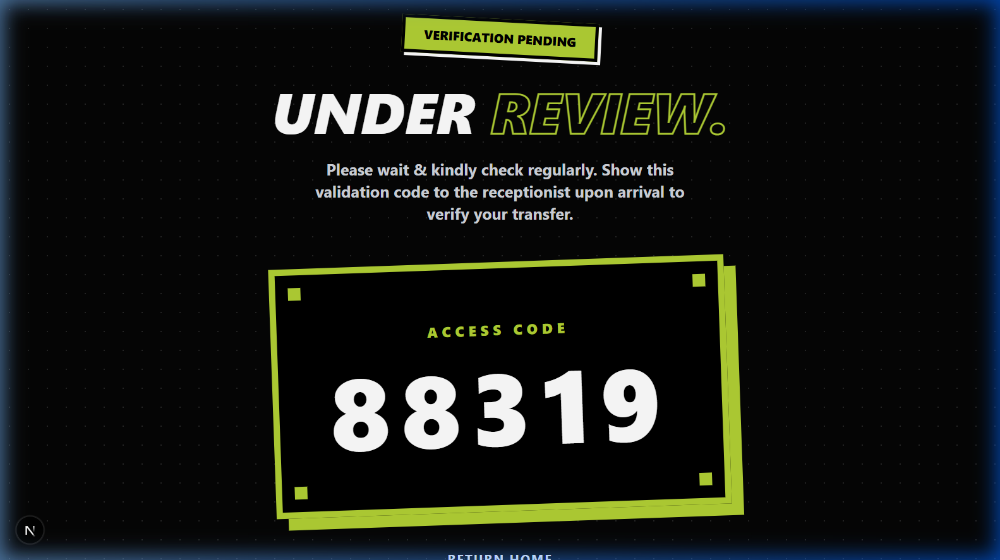
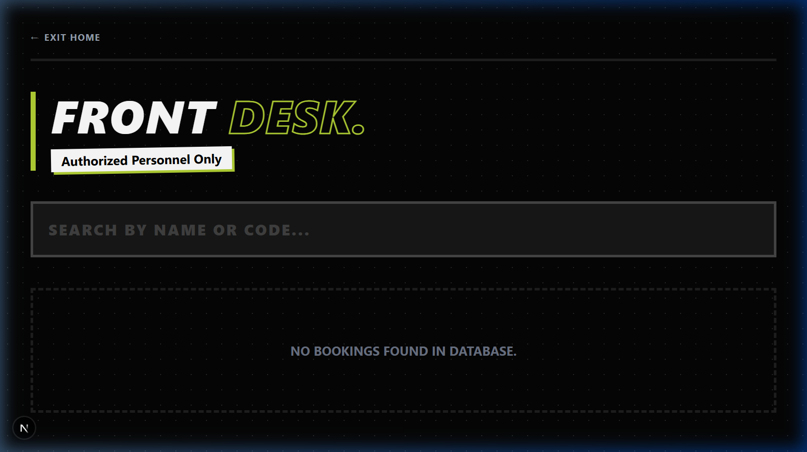

# 🎾 Vamos Arena – Digital Padel & Arena Booking System

Welcome to the **Vamos Arena** showcase repository. This repository is dedicated to presenting the design, features, architecture, and live flows of the **Vamos Arena** digital platform, while keeping the proprietary client codebase private.

[](#)
[](https://nextjs.org/)
[](https://tailwindcss.com/)
[-34a853.svg?style=flat&logo=google-sheets)](https://www.google.com/sheets/about/)

---

## 📖 Overview

**Vamos Arena** is a modern, high-performance web application designed for a premium Padel tennis facility. It features an aesthetic, neo-brutalist dark-themed design and streamlines arena operations, court bookings, facility previews, and booking verifications. 

To keep operational overhead and server maintenance costs at **zero**, Vamos Arena is built on a **fully serverless architecture** that leverages **Google Sheets** as a real-time database, communicating via a **Google Apps Script web service gateway**.

---

## 🛠️ Technology Stack

- **Frontend Framework:** Next.js (App Router, React 19, TypeScript)
- **Styling:** Tailwind CSS (v4) with high-contrast, modern custom design tokens (Neo-Brutalist elements, neon accents)
- **State & Routing:** Next.js Server & Client components, local storage session persistence
- **Backend / Database:** Serverless Google Apps Script API acting as a database router and file storage
- **Data Persistence:** Google Sheets (real-time booking ledger) + Google Drive (receipt image storage)

---

## 📐 System Architecture

### Component Diagram


### Sequence Flow (Booking & Verification)


---

## ⚡ Key Features

1. **Interactive Padel Calendar & Availability Grid**: Displays 31 rolling booking days starting from a configurable local window, updating the number of remaining spots dynamically.
2. **Double-Session Courts System**: Supports **Center Court** and **Courts 1-9** with 9 set two-hour daily time slots.
3. **Receipt Validation & File Handling**: Checkout form with custom file upload handler that automatically rejects screenshots > 1MB, encodes proof of transfer to Base64, and pushes it asynchronously to the database.
4. **Auto-refreshing Front Desk Admin Console**: Real-time admin dashboard with continuous polling (every 10 seconds), full search bar filtering (by name or verification code), and direct indicators for reception verification.
5. **Session Ticket Sync**: Local storage integration ensures customers do not lose access to their latest ticket, letting them recheck verification status directly from the home banner.

---

## 🖼️ Visual Walkthrough

### 1. Landing Page & Court Reservation
A premium, dark-themed interface with vibrant neon accents and a custom grid layout. Includes an interactive calendar to select dates.


### 2. Facilities Showcase
Beautifully displays the high-end premium facilities of the Arena.


### 3. Court Detail slots grid
Shows live-synced reservation slots. Red slots indicate court bookings already verified or under review.


### 4. Custom Checkout & Payment Upload
Fully functional payment verification flow. Features input fields for PIC details, WhatsApp connection, and receipt screenshot upload.


### 5. Access Ticket & Code Delivery
Unique 5-digit alpha-numeric ticket generation. Displayed clearly for the receptionist to verify arrival.


### 6. Receptionist Desk (Admin Control Panel)
Allows the arena staff to view all bookings in real time, search for codes/names, view receipt screenshots, and verify payments.


---

## 🚀 How It Works (Development Environment Guide)

If you are modifying this type of serverless project, here is how you can set up a local replica.

### 📋 Prerequisites
- [Node.js](https://nodejs.org/) (v20+ recommended)
- A Google Account (for Google Sheets & Apps Script setup)

### 🚀 Getting Started

1. **Install Dependencies**:
   ```bash
   npm install
   ```

2. **Configure Google Apps Script**:
   Create a Google Apps Script in your Google Drive and bind it to a spreadsheet. Paste the Apps Script handler code (sample structure below):
   ```javascript
   function doGet(e) {
     var sheet = SpreadsheetApp.getActiveSpreadsheet().getActiveSheet();
     var data = sheet.getDataRange().getValues();
     var headers = data[0];
     var list = [];
     for(var i = 1; i < data.length; i++) {
       var row = {};
       for(var j = 0; j < headers.length; j++) {
         row[headers[j]] = data[i][j];
       }
       list.push(row);
     }
     return ContentService.createTextOutput(JSON.stringify(list))
       .setMimeType(ContentService.MimeType.JSON);
   }

   function doPost(e) {
     var params = JSON.parse(e.postData.contents);
     var sheet = SpreadsheetApp.getActiveSpreadsheet().getActiveSheet();
     
     // Handle base64 receipt upload (store file in Google Drive)
     var fileUrl = "";
     if (params.imageBase64) {
       var folder = DriveApp.getFolderById("YOUR_GOOGLE_DRIVE_FOLDER_ID");
       var file = folder.createFile(Utilities.newBlob(Utilities.base64Decode(params.imageBase64), params.mimeType, params.fileName));
       fileUrl = file.getUrl();
     }

     sheet.appendRow([
       params.uniqueCode,
       params.picName,
       params.picWa,
       params.clubName,
       params.clubIg,
       params.reclubLink,
       params.totalMember,
       params.rekNumber,
       params.date,
       params.court,
       params.time,
       fileUrl,
       "PENDING VERIFICATION"
     ]);
     return ContentService.createTextOutput(JSON.stringify({status: "success"}))
       .setMimeType(ContentService.MimeType.JSON);
   }
   ```
   Deploy this Apps Script web app with access set to "Anyone" and copy the Web App URL.

3. **Update Next.js config**:
   Replace the API endpoints in `src/app/page.tsx`, `src/app/court/[id]/page.tsx`, `src/app/checkout/page.tsx`, and `src/app/admin/page.tsx` with your deployed Apps Script web app URL.

4. **Run Dev Mode**:
   ```bash
   npm run dev
   ```
   Open [http://localhost:3000](http://localhost:3000) to view and test the application.

---

## 🔒 Confidentiality Notice

This repository contains **only presentation materials** and documentation for showcase purposes. No proprietary source code is hosted here. Copying, distributing, or attempting to decompile this system without authorization is strictly prohibited.

For inquiries or custom software integration, contact the repository owner.
