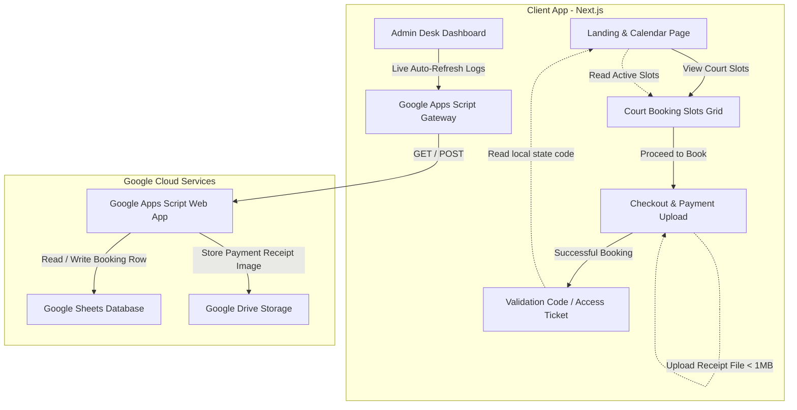
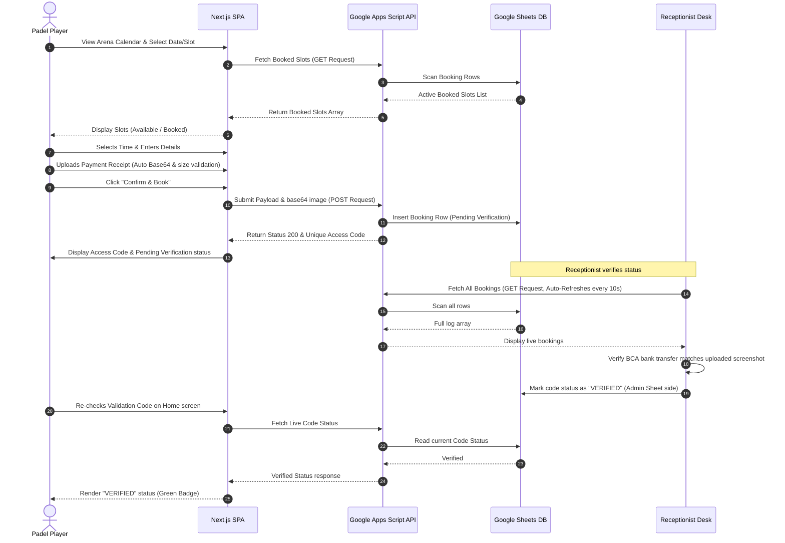
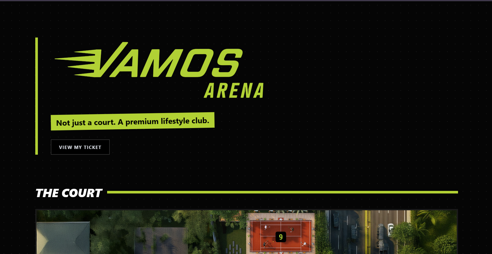
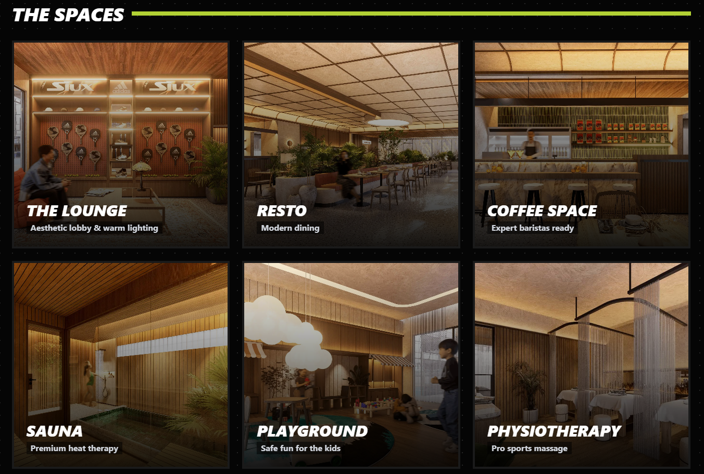
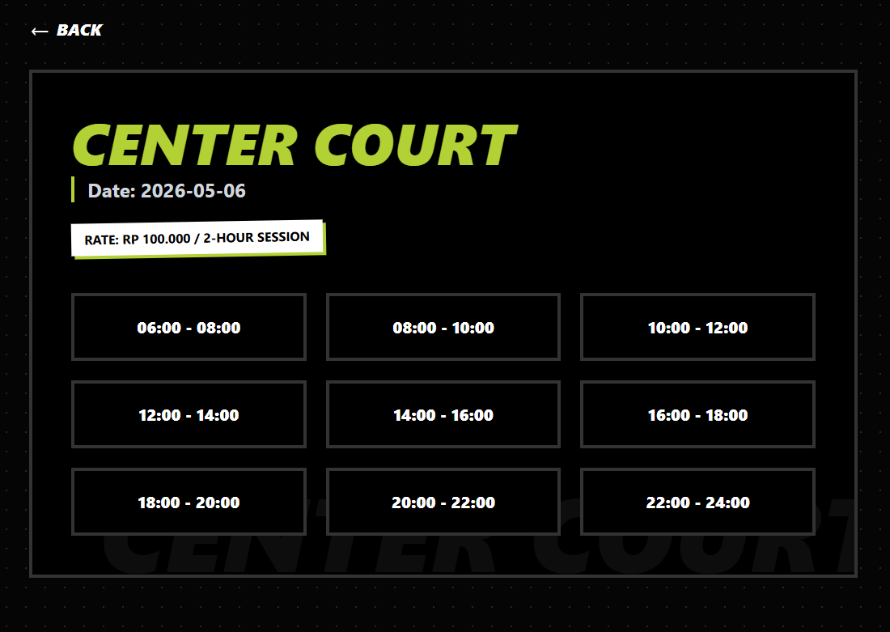
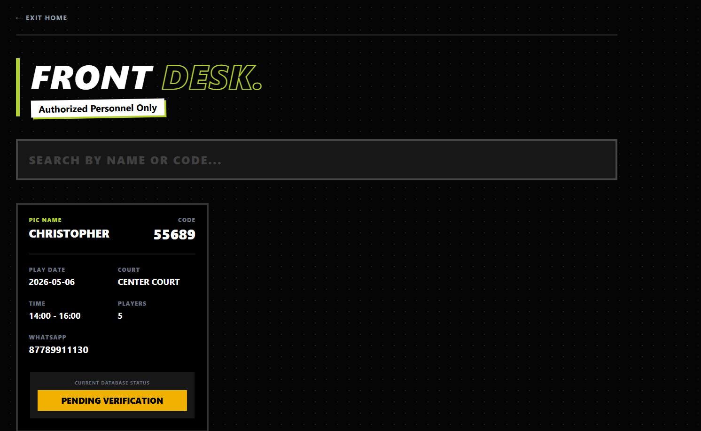

# 🎾 Vamos Arena / Digital Padel Booking System
**[Live Official Website ↗](https://vamos-arena-indo.vercel.app/)**

*Note: This repository is an architectural showcase and case study. The actual source code is proprietary and owned by the client, so this repo serves to document the system design, features, and technical workflows.*

[-34a853.svg?style=flat&logo=google-sheets)](https://www.google.com/sheets/about/)

---

## Overview

**Vamos Arena** is web application designed for a premium Padel tennis facility that streamlines arena operations, court bookings, facility previews, and booking verifications. 

---

## Technology Stack

- **Frontend Framework:** Next.js (App Router, React 19, TypeScript)
- **Styling:** Tailwind CSS
- **State & Routing:** Next.js Server & Client components, local storage session persistence
- **Backend / Database:** Serverless Google Apps Script API acting as a database router and file storage
- **Data Persistence:** Google Sheets (real-time booking ledger) + Google Drive (receipt image storage)

---

## System Architecture

### Component Diagram

### Sequence Flow (Booking & Verification)

---

## Key Features

1. **Interactive Padel Calendar & Availability Grid**: Displays 31 rolling booking days starting from a configurable local window, updating the number of remaining spots dynamically.
2. **Double-Session Courts System**: Supports **Center Court** and **Courts 1-9** with 9 set two-hour daily time slots.
3. **Receipt Validation & File Handling**: Checkout form with custom file upload handler that automatically rejects screenshots > 1MB, encodes proof of transfer to Base64, and pushes it asynchronously to the database.
4. **Auto-refreshing Front Desk Admin Console**: Real-time admin dashboard with continuous polling (every 10 seconds), full search bar filtering (by name or verification code), and direct indicators for reception verification.
5. **Session Ticket Sync**: Local storage integration ensures customers do not lose access to their latest ticket, letting them recheck verification status directly from the home banner.

---

## Visual Walkthrough

### 1. Landing Page & Court Reservation

### 2. Facilities Showcase
Displays the facilities of the Arena.

### 3. Court Detail slots grid
Shows live-synced reservation slots. Red slots indicate court bookings already verified or under review.

### 4. Custom Checkout & Payment Upload
Fully functional payment verification flow. Features input fields for PIC details, WhatsApp connection, and receipt screenshot upload.

### 5. Access Ticket & Code Delivery
Unique 5-digit alpha-numeric ticket generation. Displayed clearly for the receptionist to verify arrival.

### 6. Receptionist Desk (Admin Control Panel)
Allows the arena staff to view all bookings in real time, search for codes/names, view receipt screenshots, and verify payments.

---

## Confidentiality Notice

This repository contains **only presentation materials** and documentation for showcase purposes. No proprietary source code is hosted here. Copying, distributing, or attempting to decompile this system without authorization is strictly prohibited.

For inquiries or custom software integration, contact the repository owner.
